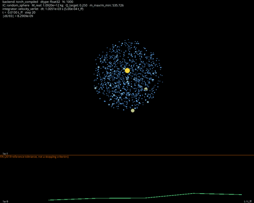
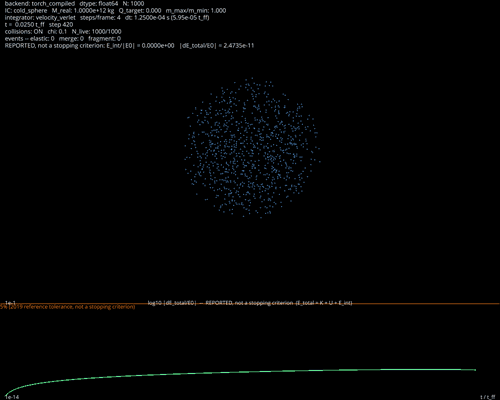
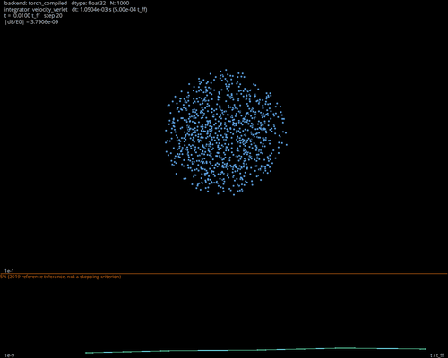

# TCCAstro


[](LICENSE)

## A Simulação

Simulação de colisão em n-corpos com mil partículas de massas heterogêneas que colapsa sob gravidade e exibe um fenômeno emergente: um corpo cresce acumulando massa, absorvendo os demais, sem limite estrutural.

**Mil corpos, massas variadas**: A distribuição segue um espectro tipo Salpeter, $dN/dm \propto m^{-2.35}$, truncado para garantir um a três corpos massudos por realização. As velocidades iniciais são maxwellianas isotrópicas, parametrizadas pela razão virial $Q = 2K/|U|$, em regime que preserva forte ligação gravitacional.



Colapso de população heterogênea com razão de massa ~140×, destacando o corpo mais massudo em dourado. Atinge compressão máxima em t ≈ 1,19 $t_{ff}$, mais tardia que no colapso frio porque a velocidade inicial (razão virial $Q = 0,25$) oferece suporte contra o colapso.

**Colisão como evento discreto**: Um detector de contato varrido captura encontros enquanto os corpos se aproximam. Cada colisão resolve em um de três desfechos, sorteado com probabilidades enviesadas pela violência do choque:

- **choque elástico**: conserva energia, momento e momento angular exatamente;
- **fusão** (2 → 1): dois corpos coalescem em um único corpo de massa combinada;
- **fragmentação** (2 → 2): o par se quebra em dois fragmentos com massas sorteadas.

**O resultado**: quatro sementes de colisão sobre uma mesma realização de posições, 3 tempos de queda livre, N = 1000 corpos. Medido em 2026-08-08:

- **Transição para crescimento descontrolado**: entre 1,95 e 1,99 $t_{ff}$
- **Duração da transição**: entre 0,54 e 0,70 $t_{ff}$  
- **Corpo dominante**: 29 % a 32 % de toda a massa
- **Corpos restantes**: aproximadamente 780 corpos vivos
- **Conservação**: massa e momento exatos, desvio máximo 2,4×10⁻¹⁶ em 12.601 passos



Um corpo dominante emerge e cresce absorvendo o núcleo, terminando com ~29 % da massa total de 1000 partículas iniciais.

O modelo não tem sumidouro de massa. A fragmentação conserva a massa do par e a fusão apenas a concentra, logo a física não fornece teto de massa para corpo algum. Esse crescimento não é defeito — é consequência estrutural do modelo, e é falsificável: alterações em $\chi$ (raio de contato) ou na forma do mapa de regime devem produzir padrão diferente ou impedir o fenômeno.

O que essas quatro execuções testam é a robustez às escolhas estocásticas do modelo de colisão, não a robustez entre realizações: a condição inicial é a mesma nas quatro, e o crescimento descontrolado é um fenômeno de núcleo, cuja taxa de encontros depende das flutuações locais de densidade que a realização fixa. Variar a semente de posições continua por fazer, e a dispersão pequena entre as quatro (4 % no valor final) é indício de que é a condição inicial, e não o sorteio, que fixa o desfecho.

## Como o Trabalho foi Feito

**Documento normativo escrito antes do código.** Antes de qualquer implementação, a Seção 4 de `docs/simulacao-estocastica.md` fixou a física: definições de colisão, regime de desfecho, algoritmo de detecção varrida, conservação exigida. Cada constante, cada tolerância, cada critério de aceitação necessários aos testes estão no documento.

**Testes escritos sem ler a implementação.** A suite de testes foi redigida por agente que leu o documento normativo mas não leu o código de `src/nbody/collisions.py`. O resultado: 308 testes, 308 passando. As divergências iniciais foram todas de construção dos próprios testes, não de bugs de código. Além disso, a suite independente descobriu uma inconsistência interna do documento: uma seção exibia um invariante que outra seção já havia revogado.

**Dois erros reais foram achados por medição.** 

1. O parâmetro de regime $x$ deveria incluir um termo de energia gravitacional que o mantivesse baixo, regulando o crescimento. Implementação fiel ao documento o carregou e o executou. Medição mostrou: não funcionava. Pior: aumentava o crescimento em vez de contê-lo. Análise revelou que o termo nunca fora válido — a premissa sobre queda isolada de dois corpos desde o infinito não se aplica no núcleo colapsado (a densidade local é alta, e o poço de Plummer é raso). O termo foi retirado (Seção 4.6.1 do documento).

2. O mapa de regime usava um softmax com dois parâmetros `(b, w)` marcados como pendentes de calibração. A calibração exigida não existia — nenhuma campanha futura a produziria. O mapa foi rescrito como a mesma forma em `w = 1, b = ln 3`, sem transcendentais, sem parâmetros a calibrar (Seção 4.7 revisada). Três operações básicas no lugar de `exp`, `log`, `log-sum-exp`.

**Previsão escrita antes de medir, que falhou — e levou ao entendimento correto do modelo.** O documento previu que o corpo dominante terminaria com cerca de 3 vezes a massa média, ou 1% da massa total. Medição mostrou 321 vezes a massa média, 32% da massa total — duas ordens de grandeza acima. 

A investigação começou com o termo gravitacional em $x$: se o termo causava o crescimento, retirá-lo deveria contê-lo. Retirou e rodou de novo. Falhou de novo, com a massa máxima no mesmo valor. Agora $x$ não dependia mais de massa alguma, então havia um segundo mecanismo.

A questão foi fechada por contagem: houve 226 fusões na execução, mas montar aquele corpo por fusão exclusiva exigiria uma árvore binária de 320 eventos. Logo não foi a fusão que o construiu. O que aconteceu foi **fragmentação**: ao repartir um par muito desigual (um corpo massudo colidindo com um leve), o modelo devolve dois corpos, e o maior deles é grande. Repetido muitas vezes, esse mecanismo concentra massa. 

A descoberta é que o modelo não tem sumidouro de massa: a fragmentação conserva a massa do par e a fusão só concentra, portanto não existe teto de massa para valor nenhum de parâmetro nenhum. É consequência estrutural, não defeito. A previsão foi então reescrita (Seção 4.13.6 do documento) para descrever o crescimento em vez de negá-lo, e continua falsificável: alterar $\chi$ (raio de contato) ou a forma do mapa deve produzir padrão diferente ou impedir o fenômeno.



Colapso frio de esfera com mil partículas sob gravidade. Atinge compressão máxima em t ≈ 1,03 $t_{ff}$ e dispersa em seguida; painel inferior acompanha o erro relativo de energia em escala logarítmica.

---

## Contexto: Trabalho de 2019 e Modernização 2026

Este repositório consolida dois marcos: o trabalho de conclusão de curso de 2019, implementação em Numba com GPU NVIDIA, modernizado em 2026 com PyTorch, Triton e suporte a AMD. A simulação de colisão descrita acima — com espectro de massas, velocidades iniciais, detecção e resolução — foi desenvolvida na modernização 2026 como extensão natural do núcleo.

O trabalho de 2019 foi desenvolvido como Trabalho de Conclusão de Curso da Licenciatura em Física da Universidade Federal do Espírito Santo, sob orientação do **Prof. Dr. Roberto Colistete Júnior**. A monografia completa está disponível no [site do curso de Física da UFES em Alegre](https://fisica.alegre.ufes.br/sites/fisica.alegre.ufes.br/files/field/anexo/numba_agregacao_materia_flavio_m_s_hemerli_tcc_lic_fisica_alegre_20190711.pdf) [HEMERLI 2019].

### Nota sobre o escopo de 2019

O trabalho de 2019 tinha escopo declarado: comparação de desempenho entre implementações. Por isso modelava partículas desprovidas de volume, carga ou qualquer propriedade além de massa, e corretude física não era seu objeto. Essa decisão permanece válida para a parte benchmarked do 2019 — e está registrada não como defeito, como escopo:

> A simulação tem como objetivo demonstrar a diferença de tempo de execução entre diferentes métodos de implementação. Para isso modela-se o problema de n-corpos gravitacional com N partículas providas de massa, mas desprovidas de volume, carga ou qualquer outra propriedade física, atraindo-se exclusivamente pela força gravitacional ao longo de um número definido de iterações, e verifica-se a validade da simulação igualando a energia total do sistema à energia potencial gravitacional total do sistema no passo 0. Corretude física não é o objeto do trabalho; desempenho entre formas de implementação é. Isso não é uma limitação a desculpar, é o escopo declarado.

A extensão de 2026, com colisões, muda o objeto: agora há volume (raio de contato), eventos físicos discretos e fenômeno dinâmico a descrever. As partículas deixam de ser abstratas e a física volta a ser central. É por isso que 2026 exigiu documento normativo.

---

## Parte 1 — Trabalho de 2019

### Objetivo

Avaliar desempenho e viabilidade de Python com o módulo Numba no cálculo de agregação de matéria por força gravitacional, usando paralelismo de CPU e GPU, comparando implementações de complexidade crescente.

### Modelo físico

Gravitação newtoniana com [amolecimento de Plummer](docs/glossario.md). A aceleração sobre a partícula i é dada por

$$a_i = G \sum_{j \neq i} \frac{m_j (r_j - r_i)}{(|r_j - r_i|^2 + \varepsilon^2)^{3/2}}$$

e a energia potencial gravitacional correspondente é

$$U = -\sum_{i \lt j} \frac{G m_i m_j}{(|r_i - r_j|^2 + \varepsilon^2)^{1/2}}.$$

Força e potencial formam um par consistente ($a = -\nabla U / m$). O sistema amolecido é autônomo e hamiltoniano, logo a energia total é exatamente conservada no fluxo contínuo. Com partida fria (velocidades nulas) $K_0 = 0$, portanto $E_0 = U_0$ por definição, e $E(t) = U_0$ é identidade do problema — todo desvio medido é erro do [integrador](docs/glossario.md).

O amolecimento $\varepsilon$ evita divisão por zero sem usar estruturas condicionais, que prejudicariam a compilação e o paralelismo. Com $\varepsilon = 10^{-10}$ m, porém, ele não é uma regularização física: o que ele protege é o termo de autointeração $i = j$, não o encontro próximo entre duas partículas distintas. Um valor dessa ordem só é inofensivo porque a execução tem um único passo a partir de uma grade regular, em que nenhuma partícula chega perto de outra. Numa integração longa a partir de posições aleatórias, $\varepsilon = 10^{-10}$ m produziria acelerações arbitrariamente grandes no primeiro par que se aproximasse.

### Método numérico

[Euler semi-implícito](docs/glossario.md). Atualiza-se a velocidade de todas as partículas e só então a posição, usando a velocidade já atualizada:

$$v_{t+1} = v_t + a_t \cdot dt$$
$$r_{t+1} = r_t + v_{t+1} \cdot dt$$

A escolha do integrador foi subordinada ao objetivo de benchmark: simplicidade era fator declarado, e o custo computacional elevado era útil ao estudo, por ampliar a diferença de tempo entre implementações eficientes e ineficientes. A monografia registra que outros integradores como Verlet e Runge-Kutta de ordens diversas poderiam reduzir o erro ao custo de mais computação [GIORDANO 2006] — implementá-los ficou fora do escopo.

### Validação

Conservação de energia total como medida de erro, $E/E_0$ [DANIEL 2012], com tolerância arbitrariamente fixada em 5%. Executada com N = 1000.

### Configuração do benchmark

| parâmetro | valor |
|---|---|
| N | 32.768 (grade cúbica homogênea) |
| iterações | 1 |
| dt | 0,01 |
| eps | 1e-10 |
| G | 6,67408e-11 m³ kg⁻¹ s⁻² |
| massa por corpo | 1e9 kg |
| precisão | float64 |

Fonte: configuração registrada em [HEMERLI 2019].

O cálculo de energia foi desligado nas execuções cronometradas, por decisão registrada na monografia. A distribuição cúbica foi escolhida por ser reprodutível, ao contrário de uma distribuição aleatória. Precisão dupla na GPU foi imposta por limitação da ferramenta, não escolhida.

### Máquinas

| máquina | CPU | GPU |
|---|---|---|
| Google Colab | Intel Xeon E5-2699 | NVIDIA Tesla T4, CC 7.5 |
| Dell G3 | Intel Core i7-8750H | NVIDIA GeForce GTX 1050 Ti, CC 6.1 |
| Ideapad 320 | Intel Core i5-7200U | sem GPU dedicada |
| Neuromancer | AMD FX-6100 | NVIDIA GeForce GTX 750 Ti |

### Resultados — tempos de execução (segundos)

Tabela de tempos para N = 32.768, uma iteração. Fonte: `results/2019/benchmarks.csv`.

| implementação | Google Colab | Dell G3 |
|---|---|---|
| Python puro | 1451,5847 | 648,0228 |
| NumPy | 55,9083 | 31,2096 |
| Numba CPU serial | 11,5298 | 4,9287 |
| NumPy + Numba CPU | 33,2135 | 16,8520 |
| Numba CPU paralelo | 6,4286 | 0,7550 |
| NumPy + Numba CPU paralelo | 17,2156 | 14,9583 |
| Numba GPU (CUDA) | 0,2865 | 0,7350 |
| C | — | 7,8844 |
| C OpenMP | — | 1,3900 |

Resultados adicionais: Ideapad 320 com Python puro 936,4943 s, NumPy 56,4949 s, Numba CPU serial 7,2168 s, Numba CPU paralelo 2,9064 s. Neuromancer com Python puro 1767,1186 s, NumPy 77,7712 s, Numba CPU serial 11,5692 s, Numba CPU paralelo 3,4503 s, Numba GPU 1,2801 s.

### Razões de desempenho

Ganho de desempenho para as máquinas com medições completas. Fonte: `results/2019/benchmarks.csv`.

| relação | Google Colab | Dell G3 |
|---|---|---|
| Numba GPU sobre Python puro | 5067,5 | 881,7 |
| Numba CPU paralelo sobre Python puro | 225,8 | 858,3 |
| Numba GPU sobre NumPy | 195,2 | 42,5 |
| Numba CPU serial sobre Python puro | 125,9 | 131,5 |

### Discussão

O paralelismo em GPU via Numba superou Python puro em três ordens de grandeza no Colab. Numba com paralelismo em CPU exige uma única linha de código adicional e no Dell G3 superou C OpenMP. Combinar NumPy com Numba degradou o desempenho em relação a usar Numba sozinho, contrariando a expectativa da documentação da ferramenta. É viável praticar computação científica de alto desempenho em Python, e o problema de n-corpos serve como teste de desempenho para um caso de grande complexidade, não como medida genérica para qualquer aplicação.

---

## Parte 2 — Modernização (2026)

### Três objetivos

Melhorar o código através de refatoração e modularização. Testar Verlet de velocidades e Runge-Kutta de 4ª ordem como alternativas de integração. Adaptar a arquitetura ao hardware disponível — GPU AMD com pilha ROCm/HIP.

### Ambiente

| | |
|---|---|
| CPU | AMD Ryzen 5 9600X, 6 núcleos |
| GPU | AMD Radeon RX 9060 XT (RDNA 4, 16 GB) |
| pilha GPU | ROCm / HIP 6.4 |
| Python | 3.12.13 |
| PyTorch | 2.9.1+rocm6.4 |
| Triton | 3.5.1 |

Fonte: metadados de ambiente registrados em cada execução de benchmark.

### Melhoria do código

Refatoração em pacote `src/nbody` instalável, substituindo notebooks duplicados. Força desacoplada da integração: cada backend expõe `accelerations(r, m)`; os integradores são agnósticos de backend. Verlet e RK4 exigem esse desacoplamento porque avaliam a força em estados que não são o estado armazenado no início do passo: o Verlet, nas posições novas dentro do passo — valor que é reaproveitado como aceleração inicial do passo seguinte, de modo que o custo permanece de uma avaliação por passo; o RK4, em quatro estágios intermediários. Redução de energia por operação tensorial, sem acumulação concorrente. Instrumentação fora da região cronometrada. [Tiling](docs/glossario.md) com teto de memória configurável: a forma vetorizada ingênua materializa um tensor N × N × 3, inviável em N grande. O cálculo opera em blocos de i. Cobertura de 211 testes automatizados (pytest), incluindo equivalência entre backends, conservação de momento linear, dois corpos contra solução analítica e medição de [ordem de convergência](docs/glossario.md) empírica.

### Arquitetura — seis degraus

| degrau | backend | dispositivo |
|---|---|---|
| 1 | Python puro (listas) | CPU |
| 2 | torch eager | CPU |
| 3 | torch.compile (Inductor) | CPU |
| 4 | torch eager | GPU |
| 5 | torch.compile (Inductor → Triton) | GPU |
| 6 | kernel Triton escrito à mão | GPU |

Fonte: mapeamento de implementação conforme descrito em `src/nbody/`.

Uma única biblioteca cobre CPU e GPU. O degrau 6 é o análogo do kernel CUDA manual de 2019, agora em [Triton](docs/glossario.md), executando sobre ROCm.

### Tempos de execução em N = 1000

Avaliação de força única, [mediana e intervalo interquartil](docs/glossario.md). Fonte: `results/2026/bench_n1000.csv`.

Metodologia: [warmup](docs/glossario.md) separado da medição, repetições, mediana calculada sobre as repetições, `torch.cuda.synchronize()` antes de parar o cronômetro, metadados de ambiente gravados em cada linha.

| degrau | float32 | float64 |
|---|---|---|
| Python puro / CPU | 1,272e-1 s | 1,274e-1 s |
| torch eager / CPU | 2,771e-3 s | 8,744e-3 s |
| torch.compile / CPU | 1,404e-3 s | 1,390e-3 s |
| torch eager / GPU | 4,636e-4 s | 1,557e-3 s |
| torch.compile / GPU | 1,007e-4 s | 8,368e-4 s |
| Triton / GPU | 9,104e-3 s | 1,277e-2 s |

Os doze pontos (seis degraus × dois dtypes) concordam com a referência `torch_eager` fp64 dentro de 6e-5 m/s² em módulo nos caminhos float32 (máximo 5,143e-5) e 1e-14 m/s² nos float64 (máximo 9,326e-15). A grandeza é a diferença absoluta de aceleração, não relativa; contra a aceleração rms da condição inicial, da ordem de 1,5 m/s², o desvio float32 corresponde a cerca de 3e-5 em termos relativos, compatível com acúmulo de arredondamento em precisão simples sobre N = 1000.

### Varredura de N

N em potências de 2, de 512 a 65.536. Fonte: `results/2026/sweep_n.csv`.

Tempos em N = 32.768 (mediana, segundos):

| degrau | float32 | float64 |
|---|---|---|
| torch eager / CPU | 7,783 | 15,792 |
| torch.compile / CPU | 1,103 | 2,129 |
| torch eager / GPU | 0,606 | 1,768 |
| torch.compile / GPU | 0,054 | 1,316 |
| Triton / GPU | 0,156 | 0,216 |

Inclinações log-log medidas no topo da varredura: Python puro 1,998 (fp32) e 2,015 (fp64); torch eager CPU 2,086 e 2,048; torch eager GPU 1,990 e 1,991; torch.compile CPU 2,014; torch.compile GPU 1,984 (fp32). Nestes degraus a inclinação medida corresponde ao custo O(N²) do cálculo direto de forças.

Três degraus não apresentam inclinação 2 na faixa medida: Triton 0,529 (fp32) e 1,155 (fp64), e torch.compile GPU 2,271 (fp64). O custo do algoritmo é O(N²) por construção — cada partícula interage com todas as outras — e a inclinação medida abaixo de 2 indica que o tempo ainda não é dominado pelo cálculo naquela faixa de N, e sim por custos fixos por chamada. No caso do Triton isso é visível também na razão entre precisões: em N = 65.536 o caminho float64 custa apenas 2,8 vezes o float32, muito abaixo do que a diferença de vazão aritmética entre as duas precisões produziria num regime dominado por cálculo.

### Precisão simples contra precisão dupla

Em N = 32.768, torch.compile na GPU custa 0,054 s em float32 e 1,316 s em float64. Em float64, o custo aumenta por um fator 24,4 em relação a float32. A placa é de consumo e tem desempenho de precisão dupla reduzido por projeto, mas o fator não é atribuível apenas a isso: no mesmo N e na mesma placa, os degraus torch eager e Triton pagam penalidades de float64 muito menores (`results/2026/sweep_n.csv`). O que o fator 24,4 mede é sobretudo a perda do código gerado pelo compilador ao passar para precisão dupla, não a razão de vazão fp64/fp32 do hardware.

### Teste de integradores

Quatro integradores implementados: Euler explícito, Euler semi-implícito (o de 2019), Verlet de velocidades e Runge-Kutta de 4ª ordem.

#### Ordem de convergência

Medida contra a solução analítica de dois corpos (problema de Kepler), com refinamento de dt. Fonte: `scripts/sanity.py`.

| integrador | ordem medida | ordem teórica |
|---|---|---|
| Euler explícito | 0,66 → 0,96 | 1 |
| Euler semi-implícito | 2,000 | 1 |
| Verlet de velocidades | 2,000 | 2 |
| Runge-Kutta 4 | 4,22 → 4,03 | 4 |

Três das quatro linhas convergem para a ordem teórica conforme dt diminui. A quarta não, e a
discrepância é real: o Euler semi-implícito mede ordem 2 neste ponto de medição, não 1.

O erro é avaliado exatamente em $t = P$, um período orbital completo — um retorno à mesma vizinhança
do espaço de fase. Integradores simpléticos exibem superconvergência em pontos de retorno periódico:
a componente de erro de ordem 1 é periódica no ângulo orbital e se cancela no retorno, deixando o
termo de ordem 2 como dominante. Medindo o mesmo refinamento em $t = 0{,}37\,P$, fora de um retorno,
o Euler semi-implícito devolve ordem 1,000 limpa, que é a ordem do método. O efeito é do ponto de
medição, não do integrador.

Como consequência, os erros do Euler semi-implícito e do Verlet em $t = P$ são praticamente iguais
(4,15e-3 contra 3,97e-3), e esta tabela não separa os dois métodos. A separação entre eles aparece
nas medidas de energia adiante, feitas em tempo genérico.

#### Comparação a custo igual

O eixo justo é o número de [avaliações de força](docs/glossario.md), não o número de passos: RK4 custa 4 avaliações por passo, os demais custam 1. Comparar com o mesmo dt daria ao RK4 quatro vezes mais trabalho.

Colapso frio esférico, N = 1000, float64, até 1,2 [tempos de queda livre](docs/glossario.md). Fonte: `results/2026/integrator_study.csv`.

Erro de posição contra referência de alta resolução:

| avaliações de força | Euler explícito | Euler semi-impl. | Verlet | RK4 |
|---|---|---|---|---|
| 12.600 | 5,29e-2 | 8,65e-5 | 3,05e-6 | 3,86e-8 |
| 25.200 | 3,09e-2 | 4,35e-5 | 7,62e-7 | 1,43e-9 |
| 50.400 | 1,77e-2 | 2,18e-5 | 1,91e-7 | 6,61e-11 |
| 100.800 | 9,87e-3 | 1,09e-5 | 4,76e-8 | — |

O tempo de parede é idêntico entre os quatro no mesmo orçamento (9,5 s / 18,8 s / 37,4 s / 74,5 s), confirmando que a avaliação de força domina o custo.

O Verlet consome uma avaliação de força adicional antes do laço, para estabelecer a aceleração inicial: os totais registrados em `results/2026/integrator_study.csv` são 12.601, 25.201, 50.401 e 100.801, contra os orçamentos nominais da tabela. A diferença é de 0,008% e não altera nenhuma comparação, mas o custo é contabilizado.

**Nota:** o erro do RK4 é medido contra referência gerada pelo próprio RK4, portanto enviesado a seu favor. O valor de 100.800 avaliações foi omitido por estar no piso da referência.

#### Comportamento da energia

[Integradores simpléticos](docs/glossario.md) e não simpléticos se discriminam pelo comportamento da energia ao longo de uma integração. Orçamento de 12.600 avaliações. Fonte: `results/2026/integrator_study.csv`.

| integrador | máx \|dE/E₀\| | valor final | razão |
|---|---|---|---|
| Euler explícito | 1,40e-1 | +1,40e-1 | 1,0 |
| Euler semi-implícito | 9,41e-3 | +3,73e-4 | 25 |
| Verlet de velocidades | 3,14e-5 | −5,30e-8 | 593 |
| RK4 | 2,96e-7 | −2,52e-7 | 1,2 |

Razão próxima de 1 indica deriva secular: a energia sai e não retorna. Razão alta indica oscilação limitada: o erro é injetado na travessia pelo centro de massa e devolvido na saída. Os dois métodos simpléticos, Euler semi-implícito e Verlet de velocidades, oscilam e retornam; os dois não simpléticos, Euler explícito e RK4, derivam [HAIRER 2006].

O RK4 apresenta o menor desvio absoluto de todos, e ainda assim deriva: magnitude do erro e estrutura do erro são propriedades independentes. Um método de ordem alta pode ser mais preciso que um simplético em um horizonte curto e mesmo assim acumular sistematicamente, enquanto o simplético não acumula.

#### Horizonte longo

Dez tempos de queda livre, custo igual por unidade de tempo físico. Fonte: `results/2026/longrun_energy.csv`.

| integrador | máx \|dE/E₀\| | cruza 5%? |
|---|---|---|
| Euler explícito | 6,48e-1 | sim, em t/t_ff = 1,033 |
| Euler semi-implícito | 9,37e-3 | não |
| Verlet de velocidades | 3,53e-5 | não |
| RK4 | 1,06e-6 | não |

O Euler explícito ultrapassa a tolerância de 5% em t/t_ff = 1,033, imediatamente antes da compressão máxima, que ocorre em 1,036 — ou seja, durante a primeira passagem pelo centro de massa. O Euler semi-implícito permanece dentro dela em todo o horizonte. A [deriva secular](docs/glossario.md) do RK4 é linear no tempo, com coeficiente 9,36e-8 por t_ff e R² = 0,997 sobre 2.953 pontos. As bandas do Verlet e do Euler semi-implícito não apresentam tendência de crescimento ao longo dos dez tempos de queda livre: a excursão grande de ambos ocorre uma única vez, no colapso em t/t_ff ≈ 1, e depois que o sistema viraliza a banda cai mais de uma ordem de grandeza e permanece estacionária pelo resto do horizonte.

### Condição inicial

[Esfera fria](docs/glossario.md) de densidade uniforme em repouso. O [tempo de queda livre](docs/glossario.md) tem forma analítica:

$$t_{ff} = \sqrt{\frac{3\pi}{32 G \rho}}$$

O que permite validar a dinâmica contra uma previsão fechada. O colapso medido atinge raio de meia-massa mínimo em t/t_ff ≈ 1,03.

Parâmetros: N = 1000, eps = 0,05 m, G e massa com os valores físicos de 2019, semente fixa. Fonte: `src/nbody/initial_conditions.py`.

---

## Estrutura do repositório

```
TCCAstro/
├── src/nbody/
│   ├── config.py               # Constantes e conjuntos de parâmetros
│   ├── state.py                # Contêiner imutável do estado dinâmico
│   ├── initial_conditions.py   # Esfera fria e casos de dois corpos
│   ├── populations.py          # Espectro de massas e velocidades iniciais
│   ├── observables.py          # Energia e quantidade de movimento
│   ├── integrators.py          # Os quatro integradores e o laço
│   ├── collisions.py           # Detecção e resolução de colisões
│   ├── _pairwise.py            # Auxiliares de tiling
│   └── backends/               # Os seis backends de cálculo de força
├── legacy/notebooks-2019/      # Os quatro notebooks originais, intocados
├── tests/                      # Suíte de testes (pytest)
├── scripts/
│   ├── sanity.py               # Ordem de convergência e colapso
│   ├── bench.py                # Benchmark em N fixo
│   ├── sweep_n.py              # Varredura de N
│   ├── integrator_study.py     # Integradores a custo igual
│   ├── longrun_energy.py       # Energia em horizonte longo
│   ├── crossover_scaling_law.py # Lei de escala do cruzamento
│   ├── realtime.py             # Visualizador interativo do colapso
│   ├── capture_collapse_gif.py # Captura de vídeo para GIF
│   └── extract_legacy_results.py # Extração dos resultados de 2019
├── results/
│   ├── 2019/                  # Dados extraídos dos notebooks originais
│   └── 2026/                  # Dados da modernização
├── figures/
├── docs/
│   ├── referencias.md         # Referências bibliográficas ABNT
│   ├── glossario.md           # Glossário técnico
│   ├── integradores.md        # Especificação física normativa
│   ├── simulacao-estocastica.md # Especificação de colisões e populações
│   └── tcc-2019-extrato.md    # Extrato da monografia original
└── README.md
```

---

## Como reproduzir

Instalar dependências:
```bash
pip install -e .
pip install torch torchvision torchaudio --index-url https://download.pytorch.org/whl/rocm
pip install triton
```

Executar testes:
```bash
pytest tests/
```

Ver a simulação com colisões em tempo real:
```bash
python scripts/realtime.py --collisions
```

Rodar as campanhas:
```bash
python scripts/sanity.py              # ordem de convergência e colapso, minutos
python scripts/bench.py               # os seis degraus em N = 1000
python scripts/sweep_n.py             # varredura de N, ~50 min
python scripts/integrator_study.py    # integradores a custo igual
python scripts/longrun_energy.py      # energia ao longo de 10 t_ff
```

Os resultados são gravados em `results/2026/` como CSV estruturado, com metadados de ambiente em cada linha.

---

## Referências

[HEMERLI 2019] HEMERLI, F. M. S. Computação de alto desempenho usando Numba para cálculo de agregação de matéria. 2019. Trabalho de Conclusão de Curso (Licenciatura em Física) — Centro de Ciências Exatas, Naturais e da Saúde, Universidade Federal do Espírito Santo, Alegre, 2019. Disponível em: https://fisica.alegre.ufes.br/sites/fisica.alegre.ufes.br/files/field/anexo/numba_agregacao_materia_flavio_m_s_hemerli_tcc_lic_fisica_alegre_20190711.pdf. Acesso em: 3 ago. 2026.

[LAM 2015] LAM, S. K.; PITROU, A.; SEIBERT, S. Numba: a LLVM-based Python JIT compiler. In: Proceedings of the Second Workshop on the LLVM Compiler Infrastructure in HPC (LLVM-HPC 2015). New York: ACM, 2015.

[DANIEL 2012] DANIEL, J. L.; FOSTER-O'NEAL, J. K. The numerical open-source many-body simulator (NOMS). 2012.

[GIORDANO 2006] GIORDANO, N. J.; NAKANISHI, H. Computational physics. 2. ed. Upper Saddle River: Prentice-Hall, 2006.

[HALLIDAY 2000] HALLIDAY, D.; RESNICK, R.; WALKER, J. Fundamentos de Física: Gravitação, Ondas e Termodinâmica. v. 2. Rio de Janeiro: Grupo Gen-LTC, 2000.

[PLUMMER 1911] PLUMMER, H. C. On the problem of distribution in globular star clusters. Monthly Notices of the Royal Astronomical Society, v. 71, n. 5, p. 460-470, 1911.

[NYLAND 2007] NYLAND, L.; HARRIS, M.; PRINS, J. Fast n-body simulation with CUDA. In: NGUYEN, H. (Ed.). GPU Gems 3. Boston: Addison-Wesley, 2007. cap. 31.

[HARRIS 2020] HARRIS, C. R. et al. Array programming with NumPy. Nature, v. 585, p. 357-362, 2020.

[VERLET 1967] VERLET, L. Computer "experiments" on classical fluids. I. Thermodynamical properties of Lennard-Jones molecules. Physical Review, v. 159, n. 1, p. 98-103, 1967.

[HAIRER 1993] HAIRER, E.; NØRSETT, S. P.; WANNER, G. Solving ordinary differential equations I: nonstiff problems. 2. ed. Berlin: Springer, 1993.

[HAIRER 2006] HAIRER, E.; LUBICH, C.; WANNER, G. Geometric numerical integration: structure-preserving algorithms for ordinary differential equations. 2. ed. Berlin: Springer, 2006.

[BINNEY 2008] BINNEY, J.; TREMAINE, S. Galactic dynamics. 2. ed. Princeton: Princeton University Press, 2008.

[PASZKE 2019] PASZKE, A. et al. PyTorch: an imperative style, high-performance deep learning library. In: Advances in Neural Information Processing Systems 32 (NeurIPS 2019). 2019. p. 8024-8035.

[ANSEL 2024] ANSEL, J. et al. PyTorch 2: faster machine learning through dynamic Python bytecode transformation and graph compilation. In: Proceedings of the 29th ACM International Conference on Architectural Support for Programming Languages and Operating Systems (ASPLOS 2024). New York: ACM, 2024.

[TILLET 2019] TILLET, P.; KUNG, H. T.; COX, D. Triton: an intermediate language and compiler for tiled neural network computations. In: Proceedings of the 3rd ACM SIGPLAN International Workshop on Machine Learning and Programming Languages (MAPL 2019). New York: ACM, 2019. p. 10-19.

[AMD 2024] ADVANCED MICRO DEVICES, INC. ROCm documentation. 2024. Disponível em: https://rocm.docs.amd.com. Acesso em: 2026.
